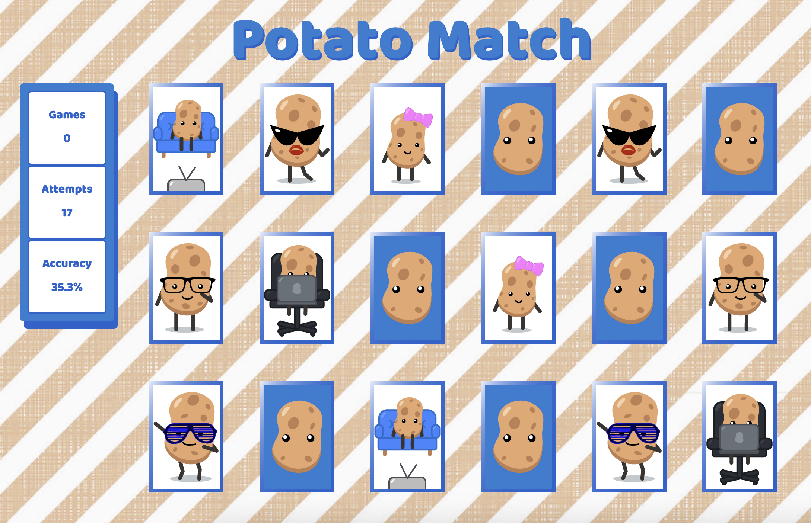

# Potato Match

> - Maintained by: `TracyLuu`


## Description

We are all potatoes. We come in different sizes, shapes, and personalities. Here's a memory match built from HTML, CSS, and Javascript for potatoes like you and me. 🥔

## Technologies Used

- HTML5
- CSS3
- JavaScript
- AWS EC2

## Live Demo
Try the application live at [http://memory-match.tracyluu.com](http://memory-match.tracyluu.com)

## Features
- User can flip cards
- User can track games played
- User can track attempts on current game
- User can view accuracy on current game
- User can restart game after matching all cards
    - Cards shuffle
    - Stats reset
- Mobile Responsiveness

## Preview


#### Getting Started

1. Clone the repository.

    ```shell
    git clone https://github.com/tracyluu/potato-match.git
    ```

2. Change directory to clone folder.

    ```shell
    cd potato-match/
    ```

3. Go to `index.html` in Text Editor and open in browser.
